# AI Extraction & Audit Report

This report documents the extraction of the complete standalone Face AI system from the original `AI-IoT-Smart-Medicine-Box` repository, detailing the disposition of every original file, rationale, dependencies, and the full AI execution pipeline.

---

## 1. Complete File Audit Table

| Original File Path | Final Status / Destination | Action | Reason / Role in System | Dependencies Traced |
|---|---|---|---|---|
| `.gitignore` | `.gitignore` | **MODIFIED** | Retained and updated for a standalone Python AI project (ignores virtualenvs, compiled `.pyc`, raw image datasets, OS artifacts). | Git configuration |
| `LICENSE` | `LICENSE` | **RETAINED** | Retained original MIT license intact. | Legal / License |
| `README.md` | `README.md` | **REPLACED** | Original root README referenced the Smart Medicine Box, ESP32-S3, ESP32-C3, Blynk, and ESP-NOW. Replaced with standalone Face AI documentation. | Documentation |
| `ai/.gitkeep` | N/A | **DELETED** | Unnecessary gitkeep marker inside the legacy `ai/` folder. | None |
| `ai/build_embeddings.py` | `src/build_embeddings.py` | **RETAINED** | Offline dataset processor and embedding database generator. Computes L2-normalized embeddings for enrolled identities. | `deepface`, `cv2`, `numpy`, `src/face_quality.py` |
| `ai/capture_enrollment.py` | `src/capture_enrollment.py` | **RETAINED** | Interactive camera enrollment tool for capturing multi-angle face samples. | `cv2`, `src/build_embeddings.py`, `src/recognize.py` |
| `ai/face_quality.py` | `src/face_quality.py` | **RETAINED** | Preprocessing and quality control module. Computes Laplacian sharpness, brightness, contrast, size filtering, and applies adaptive CLAHE + gamma enhancement. | `cv2`, `numpy`, `dataclasses` |
| `ai/README.md` | `README.md` | **CONSOLIDATED** | Legacy AI guide merged directly into root `README.md`. Original file removed with `ai/` folder. | Documentation |
| `ai/recognize.py` | `src/recognize.py` | **RETAINED** | Primary real-time inference and UI entry point. Runs multi-threaded detection, tracking, embedding matching, liveness verification, and UI visualization. | `deepface`, `tensorflow`, `cv2`, `numpy`, `src/build_embeddings.py`, `src/face_quality.py`, `edge_tts`, `pygame` |
| `ai/embeddings/.gitkeep` | N/A | **DELETED** | Empty directory marker. | None |
| `ai/embeddings/arcface.json` | `model/arcface.json` | **RETAINED** | Metadata specification for the ArcFace precomputed database (identities, counts, normalization). | Model metadata |
| `ai/embeddings/arcface.npz` | `model/arcface.npz` | **RETAINED** | Precomputed 512-D L2-normalized face embeddings database (101 vectors across Supriya & Tejwin) using ArcFace backbone. | NumPy compressed archive |
| `ai/embeddings/facenet512.json` | `model/facenet512.json` | **RETAINED** | Metadata specification for the primary FaceNet512 precomputed database. | Model metadata |
| `ai/embeddings/facenet512.npz` | `model/facenet512.npz` | **RETAINED** | Primary precomputed 512-D L2-normalized embeddings database (101 vectors across Supriya & Tejwin) using FaceNet512. | NumPy compressed archive |
| `ai/models/.gitkeep` | N/A | **DELETED** | Empty directory placeholder. | None |
| `blynk/.gitkeep` | N/A | **DELETED** | Unrelated IoT Blynk cloud folder. Not required for Face AI. | Unrelated |
| `docs/.gitkeep` | N/A | **DELETED** | Empty documentation placeholder. | Unrelated |
| `firmware/.gitkeep` | N/A | **DELETED** | Empty firmware placeholder. | Unrelated |
| `firmware/AiAuthUdpClient.h` | N/A | **DELETED** | C++ ESP32-S3 UDP client header. The Python AI system operates completely standalone without requiring ESP32 listeners. | Unrelated |
| `firmware/SmartMedicineBox_ESP32S3.ino` | N/A | **DELETED** | ESP32-S3 microcontroller firmware (Blynk, DS1302 RTC, 28BYJ-48 stepper motor, buzzer). Unrelated to standalone Face AI. | Unrelated |
| `hardware/.gitkeep` | N/A | **DELETED** | Empty hardware design placeholder. | Unrelated |
| `images/.gitkeep` | N/A | **DELETED** | Empty asset placeholder. | Unrelated |

---

## 2. AI Dependency Graph

The entire face detection, tracking, quality assessment, feature extraction, and recognition pipeline is structured as follows:

```mermaid
flowchart TD
    subgraph Input ["Camera & Video Input"]
        Cam["Webcam VideoCapture (cv2.CAP_DSHOW / MJPG)"]
        Frame["Live Frame (1280x720 BGR)"]
        Cam --> Frame
    end

    subgraph Preprocessing ["Detection & Tracking Preprocessing"]
        Frame --> Subsample["Downscale Analysis Frame (480x270 or 640x360)"]
        Subsample --> DetWorker["InferenceWorker Thread (Asynchronous)"]
        DetWorker --> Detector["Face Detector (YuNet / RetinaFace via DeepFace)"]
        Detector --> FaceBoxes["Facial Bounding Boxes (x, y, w, h)"]
        FaceBoxes --> BoxScaler["Scale Boxes to Native Frame Resolution"]
        BoxScaler --> TrackMgr["TrackManager (IoU Tracking by Association)"]
    end

    subgraph QualityControl ["Face Quality Assessment & Enhancement"]
        TrackMgr --> CropExtract["Padded Face Crop (Margin: 18%)"]
        CropExtract --> QualityAssess["assess_face_quality() in face_quality.py"]
        QualityAssess --> Metrics["Compute Laplacian Sharpness, Brightness, Contrast, Size"]
        Metrics --> UsableCheck{"Quality Usable? (score >= 0.45)"}
        UsableCheck -- No --> Reject["Status Banner: Reposition / Improve Lighting"]
        UsableCheck -- Yes --> Enhancer["enhance_face_for_embedding()"]
        Enhancer --> CLAHE["CLAHE on Y-channel (YCrCb) + Non-linear Gamma LUT"]
    end

    subgraph FeatureExtraction ["Embedding Extraction & Model Loading"]
        CLAHE --> EmbedWorker["InferenceWorker Thread"]
        EmbedWorker --> DeepFaceRep["DeepFace.represent(detector_backend='skip', align=False)"]
        DeepFaceRep --> Backbone["Model Weights: FaceNet512 (Inception-ResNet-v1) / ArcFace"]
        Backbone --> RawVector["512-Dimensional Feature Vector"]
        RawVector --> L2Norm["l2_normalize() -> Unit-length Float32 Vector"]
    end

    subgraph Matching ["Database Search & Decision Engine"]
        L2Norm --> DB["EmbeddingDatabase (model/facenet512.npz)"]
        DB --> DotProduct["Matrix Dot Product: similarities = DB.embeddings @ vector"]
        DotProduct --> Top3Median["Per-Identity Score Aggregation: Median of Top-3 Scores"]
        Top3Median --> DynamicThreshold{"Cosine Similarity Check with Quality Penalty"}
        DynamicThreshold -- "score >= 0.70 (+ penalty)" --> Candidate["Identity Candidate (e.g., Supriya, Tejwin)"]
        DynamicThreshold -- "0.60 <= score < 0.70" --> LowConf["Low Confidence"]
        DynamicThreshold -- "score < 0.60" --> Unknown["Unknown Identity"]
        Candidate --> TemporalVote["Temporal Smoothing: 2-4 votes over last 6 samples"]
    end

    subgraph VerificationOutput ["Anti-Spoofing & Output Interface"]
        TemporalVote --> MotionGate{"Require Motion Challenge?"}
        MotionGate -- Yes --> HeadTurn["Check Center Shift (>=18px) or Scale Change (>=12%)"]
        MotionGate -- No --> SpoofGate{"DeepFace Anti-Spoof Check?"}
        HeadTurn --> SpoofGate
        SpoofGate -- Yes --> MiniFASNet["DeepFace Anti-Spoofing Classifier"]
        SpoofGate -- No --> FinalDecision["AUTHORIZED: Identity Confirmed"]
        MiniFASNet --> FinalDecision
        FinalDecision --> RenderUI["OpenCV Window Overlay & Banner"]
        FinalDecision --> Voice["VoiceGuide (Edge-TTS + Pygame Audio)"]
    end
```

---

## 3. Retained Model Weights & Database Details

| Database File | Format | Vectors | Dimension | Identities Included | Source Model |
|---|---|---|---|---|---|
| `model/facenet512.npz` | NumPy NPZ (L2 unit float32) | 101 | 512 | `Supriya` (51 samples), `Tejwin` (50 samples) | `Facenet512` (Inception-ResNet-v1) |
| `model/facenet512.json` | JSON Metadata | 101 | 512 | `Supriya`, `Tejwin` | `Facenet512` |
| `model/arcface.npz` | NumPy NPZ (L2 unit float32) | 101 | 512 | `Supriya` (51 samples), `Tejwin` (50 samples) | `ArcFace` (ResNet backbone) |
| `model/arcface.json` | JSON Metadata | 101 | 512 | `Supriya`, `Tejwin` | `ArcFace` |

---

## 4. Verification Summary

1. **Standalone Operation**: The codebase has zero remaining imports or dependencies on ESP32, Arduino, Blynk, or IoT firmware.
2. **Path Autonomy**: Default paths in `src/recognize.py`, `src/build_embeddings.py`, and `src/capture_enrollment.py` resolve models dynamically relative to project root or the `model/` folder.
3. **Model Integrity**: The binary contents and NPY headers of `model/facenet512.npz` and `model/arcface.npz` are 100% preserved without re-encoding or quantization.
4. **Syntax & Compilation**: All retained modules pass `python -m py_compile` without warnings or syntax errors.
